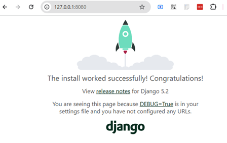
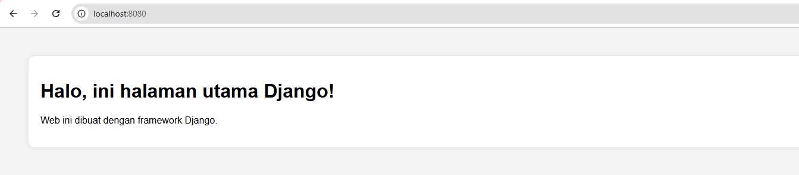

# 🚀 Belajar Django Dasar untuk Web Development

## 📌 Apa Itu Django?

**Django** adalah web framework Python tingkat tinggi yang bersifat full-stack. Framework ini dirancang untuk membantu developer membangun aplikasi web secara cepat, aman, dan terstruktur. Django menyediakan fitur lengkap seperti ORM, routing, templating, autentikasi, dan admin panel langsung dari awal.

---

## 📁 Buat Proyek Baru Django

### 1. Instal Django

Gunakan pip untuk menginstal Django:

```bash
pip install Django
```

---

### 2. Buat Proyek Django Baru

Di direktori kerja Anda, buat folder project:

```bash
django-admin startproject djangoproject
cd djangoproject
```

Struktur awalnya akan seperti ini:

```
djangoproject/
│   manage.py
|   db.sqlite3
└───djangoproject/
    │   __init__.py
    │   asgi.py
    │   settings.py
    │   urls.py
    │   wsgi.py
```

---

### 3. Jalankan Server

Untuk memastikan semuanya berjalan dengan benar, jalankan:

```bash
python manage.py runserver 8080
```

Lalu buka browser dan akses:

```
http://127.0.0.1:8080/
```


## 🖼️ Tampilan Aplikasi 

Berikut ini adalah hasil tampilan aplikasi setelah dijalankan:




---

## ⚙️ Buat Aplikasi Web Baru

Django menggunakan konsep "app" di dalam proyek. Buat app baru bernama `djangoweb`:

```bash
python manage.py startapp djangoweb
```

Maka akan terbentuk struktur baru:

```
Struktur Proyek:

djangoproject/            ← Folder root proyek (yang kamu buat sendiri)
├── manage.py             ← Entry point untuk menjalankan/migrasi project
├── djangoproject/        ← Folder konfigurasi utama project
│   ├── __init__.py
│   ├── asgi.py
│   ├── settings.py       ← Konfigurasi global (debug, db, app, dll)
│   ├── urls.py           ← Routing URL level proyek
│   └── wsgi.py
└── djangoweb/            ← App yang kamu buat (1 dari banyak)
    ├── __init__.py
    ├── admin.py          ← Pengaturan admin panel untuk model
    ├── apps.py           ← Info konfigurasi aplikasi
    ├── models.py         ← Definisi struktur tabel database
    ├── tests.py          ← Unit test untuk aplikasi ini
    ├── views.py          ← Fungsi/kelas logika tampilan
    └── migrations/       ← Catatan perubahan struktur database
```


---

### 4. Daftarkan App ke Settings

Buka `djangoproject/settings.py` dan tambahkan `'djangoweb'` ke dalam `INSTALLED_APPS`:

```python
INSTALLED_APPS = [
    ...
    'djangoweb',
]
```

---

### 5. Tambahkan View dan Routing

#### a. Buat View di `djangoweb/views.py`:

```python
from django.http import HttpResponse

def home(request):
    return HttpResponse("Selamat datang di Django!")
```

#### b. Buat File `urls.py` di Folder `djangoweb/`:

```python
from django.urls import path
from . import views

urlpatterns = [
    path('', views.home, name='home'),
]
```

#### c. Hubungkan App di `djangoproject/urls.py`:

```python
from django.contrib import admin
from django.urls import path, include

urlpatterns = [
    path('admin/', admin.site.urls),
    path('', include('djangoweb.urls')),
]
```

Sekarang buka browser ke `http://127.0.0.1:8080/` dan Anda akan melihat teks "Selamat datang di Django!"

---

## 🏠 Membuat Tampilan Home Page

### 1. Buat Folder Template

Di dalam folder `djangoweb/`, buat struktur berikut:

```
djangoweb/
└───templates/
    └───djangoweb/
        └───index.html
```

### 2. Isi File `index.html`:

```html
<!DOCTYPE html>
<html>
<head>
    <meta charset="UTF-8">
    <title>Django Web App</title>
    <style>
        body { font-family: Arial; background-color: #f4f4f4; padding: 40px; }
        .container { background: white; padding: 20px; border-radius: 10px; box-shadow: 0 0 10px rgba(0,0,0,0.1); }
    </style>
</head>
<body>
    <div class="container">
        <h1>Halo, ini halaman utama Django!</h1>
        <p>Web ini dibuat dengan framework Django.</p>
    </div>
</body>
</html>
```

### 3. Gunakan Template di View

Ubah `views.py` menjadi:

```python
from django.shortcuts import render

def home(request):
    return render(request, 'djangoweb/index.html')
```

---

## ▶️ Jalankan Ulang Aplikasi

Simpan semua perubahan dan jalankan ulang server:

```bash
python manage.py runserver 8080
```

Lalu akses di browser:

```
http://127.0.0.1:8080/
```

Anda akan melihat tampilan HTML yang telah dibuat.

---

## 🖼️ Tampilan Aplikasi 

Berikut ini adalah hasil tampilan aplikasi setelah dijalankan:


